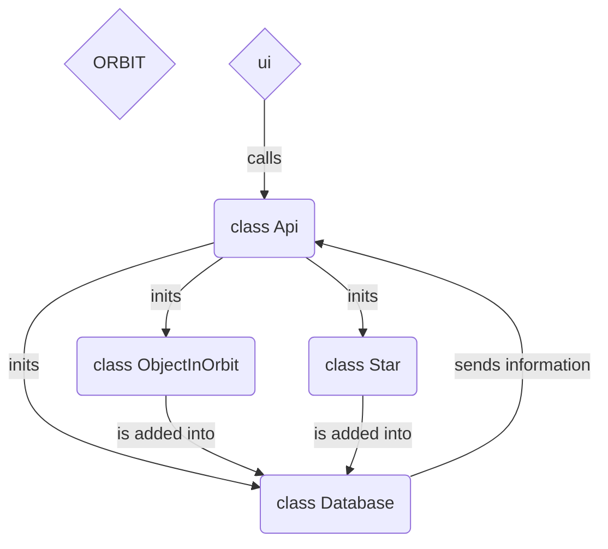

**Copyright (c) 2023 tristanGIANDO**

*Permission is hereby granted, free of charge, to any person obtaining a copy*
*of this software and associated documentation files (the "Software"), to deal*
*in the Software without restriction, including without limitation the rights*
*to use, copy, modify, merge, publish, distribute, sublicense, and/or sell*
*copies of the Software, and to permit persons to whom the Software is*
*furnished to do so, subject to the following conditions:*

*The above copyright notice and this permission notice shall be included in all*
*copies or substantial portions of the Software.*

*THE SOFTWARE IS PROVIDED "AS IS", WITHOUT WARRANTY OF ANY KIND, EXPRESS OR*
*IMPLIED, INCLUDING BUT NOT LIMITED TO THE WARRANTIES OF MERCHANTABILITY,*
*FITNESS FOR A PARTICULAR PURPOSE AND NONINFRINGEMENT. IN NO EVENT SHALL THE*
*AUTHORS OR COPYRIGHT HOLDERS BE LIABLE FOR ANY CLAIM, DAMAGES OR OTHER*
*LIABILITY, WHETHER IN AN ACTION OF CONTRACT, TORT OR OTHERWISE, ARISING FROM,*
*OUT OF OR IN CONNECTION WITH THE SOFTWARE OR THE USE OR OTHER DEALINGS IN THE*
*SOFTWARE.*

<h2 align="center" style="margin:1em;">
    </a>
</h2>

<h3 align="center">
    Orbit data calculator and 3D representation
</h3>

### A brief introduction
>I developed this tool for learning purposes and with the aim of getting closer to the field of **astronomy**, trying to link **science and 3D**.
>The results obtained are correct but not as accurate as possible because I don't yet have the necessary knowledge. What's more, I haven't used any external libraries that automate everything. Everything is done using the **math** library.
>The reason the package is open-source is so that I can exchange ideas and learn from others, and I'd be delighted to do that!

# ABOUT

**Orbit** is an application that creates a 3D representation of objects in orbit.
From some data, **Orbit** calculates additional data to refine the representation or help the research.

[](https://www.linkedin.com/posts/tristan-giandoriggio_python-sql-orbit-activity-7127721159759949824-bAER?utm_source=share&utm_medium=member_desktop)

To create an object in orbit, you will need :

|*Physical and orbital characteristics* |Unit|Info|
|-|:-:|-|
|**Name**|str|For ease, avoid starting with a number, or add `_` in front of|
|**Mass**|kg| Needed to calculate rotation speed|
|**Inclination**|deg| Difficult to find, especially for asteroids. It is not an essential element. Value can be 0|
|**Semi major axis**|AU||
|**Eccentricity**|||
|**Inclination**|deg||
|**Longitude of the ascending node**|deg||
|**Argument of periapsis**|deg||
|**Random day of perihelion**|yyyy,MM,dd|By default, it is J2000                                               |

One source I've used a lot is Wikipedia: https://fr.m.wikipedia.org/wiki/Liste_d%27objets_du_Syst%C3%A8me_solaire

Beware though, it's not always correct or accurate.

---

From the data, **Orbit** calculates additional data to refine the creation of orbits.
|*Result*|Unit|Math|
|-|:-:|-|
|**Semi minor axis**|AU|$a\sqrt{1-{e}^2}$|
|**Orbital period**|earth days|$2&#960\sqrt{{a}^3/MG}$|
|**Circumference**|m|$2&#960(aAU)$|
|**Distance at perihelion**|AU|$a(1-e)$|
|**Velocity at perihelion**|m/s|$\sqrt{G(pM+M)(2/d-1/a)}$|
|**Distance at aphelion**|AU|$a(1+e)$|
|**Velocity at aphelion**|m/s|$\sqrt{G(pM+M)(2/d-1/a)}$|
|**Position at any time**|dict|Too long...|
  
# INSTALL
* This tool is written in **Python 3**, **Qt** and uses **SQLite**.
Associated plug-in (not essential) : **Autodesk Maya 2022+**

* The tool implements `Qt.py` developed by Motosso and available here: https://github.com/mottosso/Qt.py It allows you to use any version of Qt. This is why the tool works both in standalone and in Maya.

---

From a terminal, run `pip3 install PyQt5` (or any Qt equivalent).

# USAGE

Run the file `launcher.py` from an IDE or Autodesk Maya or this code :

```py
from orbit.ui import run_ui

run_ui()
```

Once you have opened the UI, you need to determine a location where the project can be saved.
Click on the `set_project` button and select a folder.
A database is automatically created and this is where your data will be stored.

To add an object, simply enter the required data in the `Create` tab and click on the button of the same name.

If you are in standalone mode, the object you create will be added to the database, but to view it in 3D, you need to be in Autodesk Maya.

If this is not the case, don't panic, every time you open a project, Maya will read all the contents of the database and create anything that doesn't exist.
So there's never any need to save your scenes - everything is done automatically, just set up a project!


# API DOCUMENTATION



### Init project
```py
from orbit.api import Api

project_path = r"path\to\a\directory"

api = Api(project_path)
```

### Get elements
```py
elements = api.read()
```

### Add element
```py
new_object = [
            # name,
            # type,
            # parent,
            # mass,
            # orbital period,
            # object inclination,
            # semi major axis,
            # orbit inclination,
            # eccentricity,
            # ascending node,
            # argument of periapsis,
            # random perihelion / perigee date
        ]

api.add_element(new_object)
```

### Delete element
```py
object_name = "Example"

api.delete_element(object_name)
```

Made with ❤️
